# Bloom: Collaborative platform for students

## What is it?
Bloom is a collaborative platform for students with an environment adapted to cooperation. The goal of this website is to simplify management of team projects by reinventing the way students help each other without bleeding into the realm of social networks. It's the same concept as Slack but for students!

## Technologies
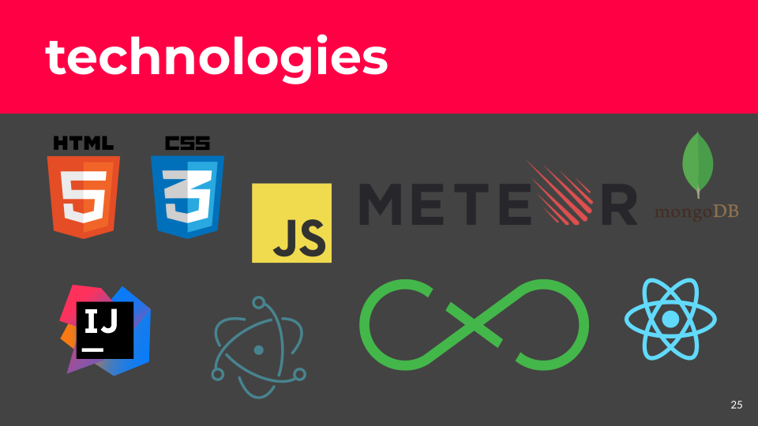

## UML
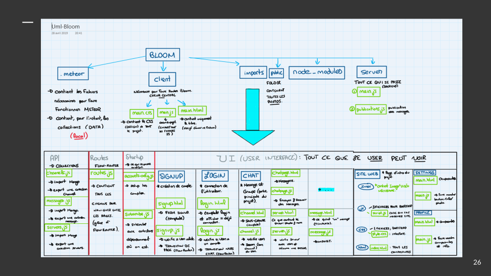

## Demo

### Overview of the Main Page
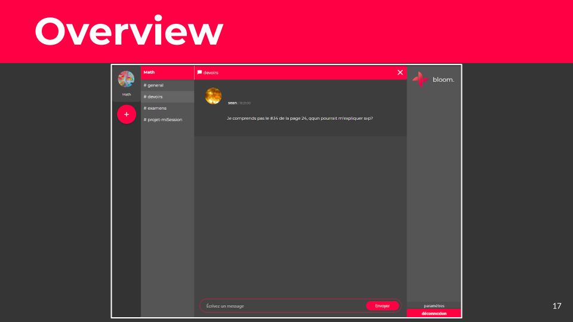

### SignUp Page
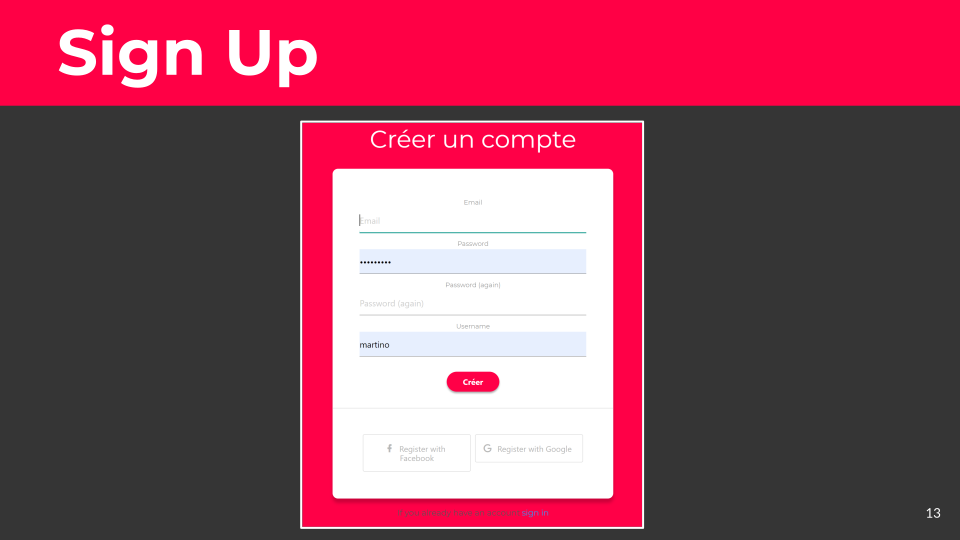

### SignIn Page
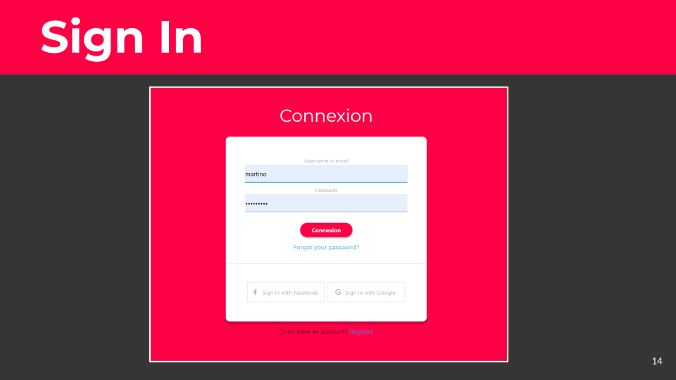

### Create a project/Chat
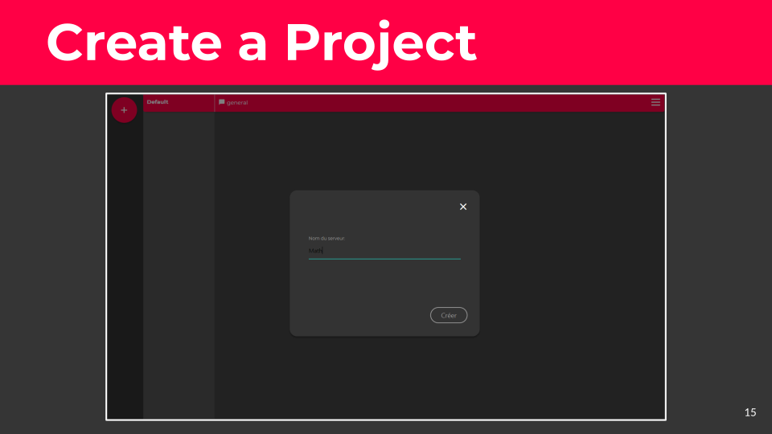

### Create a channel inside the project
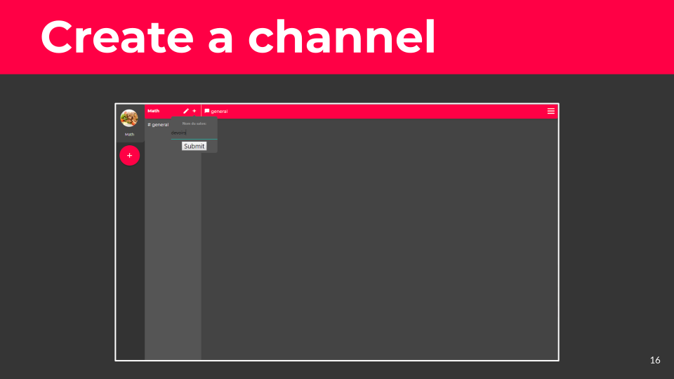

### Settings Page
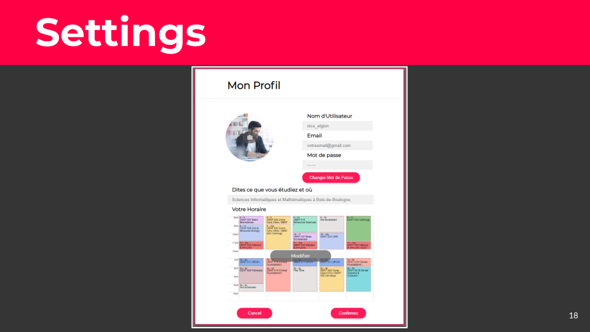

### Profile Page
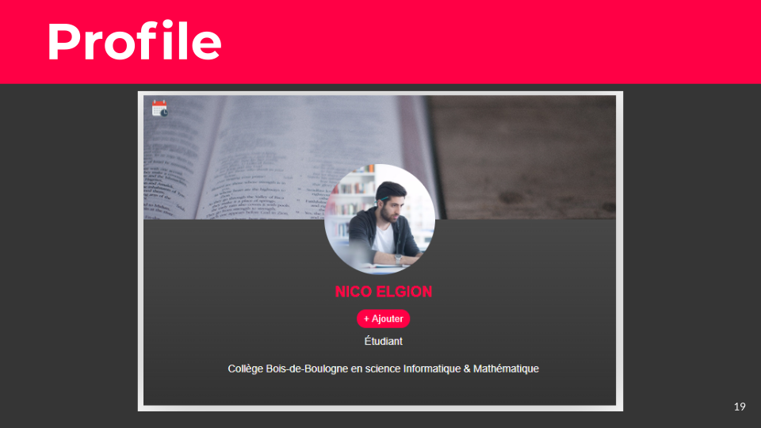
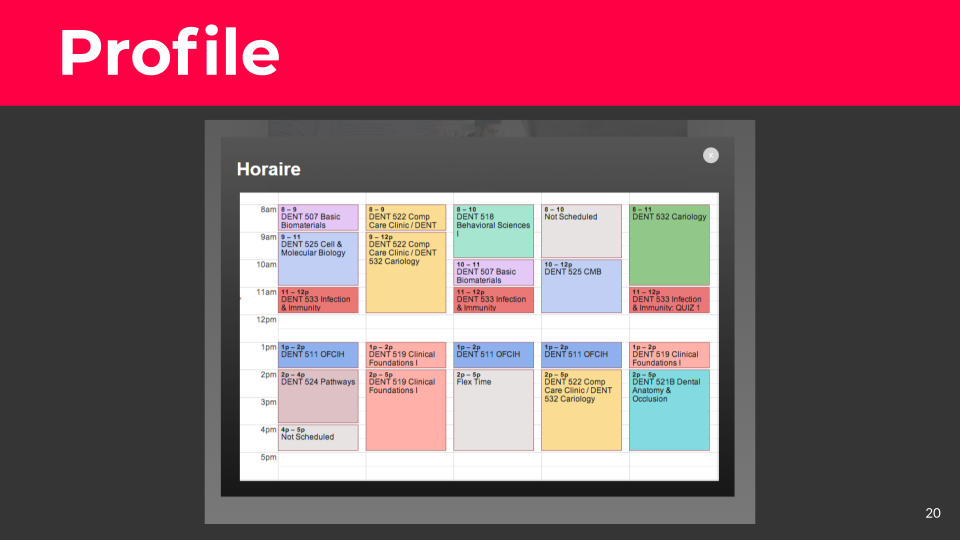

### Landing Page
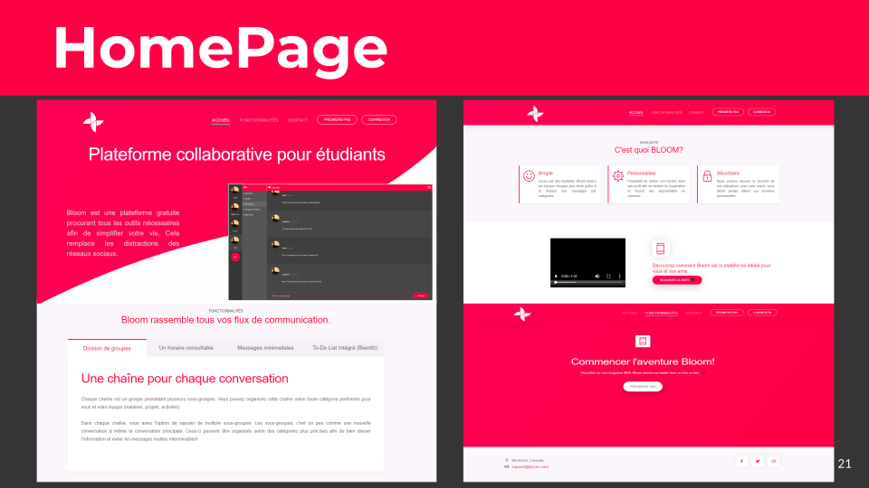

## Team
* **Seina Assadian** - [Seina's GitHub](https://github.com/seinaas)
* **Martin Senécal** - [Martin's Github](https://github.com/martinsenecal)

